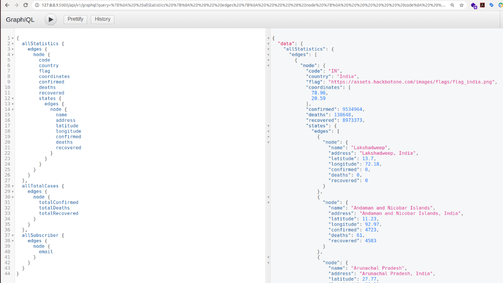
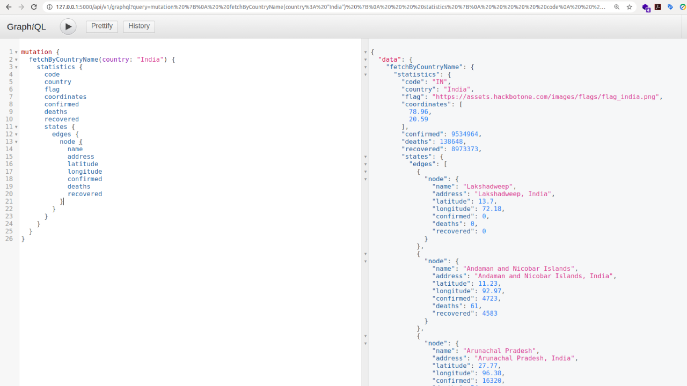

## Python GraphQL Microservices
The idea behind this project is to demonstrate using [GraphQL](https://graphql.org/) how we can query large sets of datasets by combining different sets of API endpoints? and GraphQL is a very popular data query and manipulation language developed by [Facebook](https://developers.facebook.com/docs/graph-api/) and using GraphQL we can populate large sets of data using a single query in a very faster and efficient way. To demonstrate the proof of concept I have taken the datasets from [COVID-19](https://github.com/anshumanpattnaik/covid19-full-stack-application) project and those datasets used for analysis in this project.


## Technical Overview
The proof of concept written using python and to implement the GraphQL it uses [graphene](https://pypi.org/project/graphene/) python module and the microservices designed and implemented using [flask](https://flask.palletsprojects.com/en/1.1.x/) framework and to store the data it uses mongodb database for the storage.

There are three different types of microservices designed in this project

1. Statistics
2. Total Cases
3. Subscriptions

## Installation
`````````````````````````````````````````````````````````````````````````
git clone https://github.com/anshumanpattnaik/python-graphql-microservices
cd python-graphql-microservices
pip install -r requirements.txt
source venv/bin/activate
python3 run.py
`````````````````````````````````````````````````````````````````````````

### COVID-19 Datasets
Under `covid19_dummy_data/` folder you will find the statistics data file, which you can use while adding data using `http://127.0.0.1:5000/api/v1/add_statistics` endpoint.

## GraphQL Query/Mutation
After the installation and importing the data into mongodb database, you can open `http://127.0.0.1:5000/api/v1/graphql` to view in the browser.

To refer the queries you can follow `graphql_quries/` folder for all_queries.graphql and mutation_query.graphql which you can use to analyze the data.

### All Query
Using all query it will populate three different sets of data.

1. Statistics of all counties - (allStatistics)
2. Total Cases around the world - (allTotalCases)
3. List of COVID-19 email subscribers - (allSubscriber)

``````````````````````````````````````````````````````````````````````````````
{
  allStatistics {
    edges {
      node {
        code
        country
        flag
        coordinates
        confirmed
        deaths
        recovered
        states {
          edges {
            node {
              name
              address
              latitude
              longitude
              confirmed
              deaths
              recovered
            }
          }
        }
      }
    }
  },
  allTotalCases {
    edges {
      node {
        totalConfirmed
        totalDeaths
        totalRecovered
      }
    }
  },
  allSubscriber {
    edges {
      node {
        email
      }
    }
  }
}
``````````````````````````````````````````````````````````````````````````````



### Mutation Query
Using mutation query you can populate the statistics of the individual country by passing the country name.

````````````````````````````````````````````````````````````````````
mutation {
  fetchByCountryName(country: "India") {
    statistics {
      code
      country
      flag
      coordinates
      confirmed
      deaths
      recovered
      states {
        edges {
          node {
            name
            address
            latitude
            longitude
            confirmed
            deaths
            recovered
          }
        }
      }
    }
  }
}
````````````````````````````````````````````````````````````````````



### Note
To understand more in-depth I'll highly recommend following the official documentation of [GraphQL](https://graphql.org/code/#python) and [Graphene](https://docs.graphene-python.org/en/latest/quickstart/)

### License
This project is licensed under the [MIT License](LICENSE)